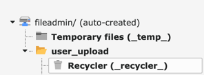

.. include:: ../Includes.rst.txt
.. _admin-manual:

Administrator manual
====================

As an administrator, we make your life as lightweight as possible, unlike other
similar extensions. The only point you need to tackle is to prevent direct
access to :file:`/fileadmin/` at the web server level.

.. note::

   You are naturally free to adapt the configuration to leave
   :file:`/fileadmin/` free to access but enable access check only for a given
   list of subdirectories. If so, your web server will bypass any possible
   restrictions the users defined to files and directories you choose to never
   ever protect.

.. _admin-manual-apache:

Installation (Apache)
---------------------

Edit file :file:`.htaccess` (or your virtual host) to read:

.. code-block:: apache

   RewriteCond %{REQUEST_URI} !/fileadmin/_processed_/.*$
   RewriteRule ^fileadmin/.*$ %{ENV:CWD}index.php [QSA,L]

**BEWARE:** Be sure to add this rule before any other related rule.

.. _admin-manual-nginx:

Installation (Nginx)
--------------------

Edit your ``server`` block to read:

.. code-block:: nginx

   location / {
     rewrite ^/fileadmin/(?!(_processed_/)) /index.php last;

     # snip
   }

or, if that better fits your setup, like that:

.. code-block:: nginx

   location ~ /fileadmin/(?!(_processed_/)) {
     rewrite ^(.+)$ /index.php last;
   }

.. _admin-manual-security-considerations:

Security considerations
-----------------------

By design, the "_processed_" folder (:file:`/fileadmin/_processed_/`) is not
protected and its content (thumbnails or resized/cropped images) is always
freely accessible. The rules above exclude this directory from useless
processing by TYPO3 but even if you ask to process absolutely everything by
this extension, files within the "_processed_" folder are always public.

Recycler
^^^^^^^^

TYPO3 supports the concept of a recycler folder where deleted files will
automatically land, if that folder exists:

You may create as many recycler folder as you want by simply creating new
folders with the name ``_recycler_``. The behaviour is that any deleted file
will land in the "nearest" recycler folder.

As such, a protected file *may* land at a higher level in the folder structure
and thus be suddenly publicly available.

We think that files within a recycler folder should never be publicly
accessible and would suggest administrators to block direct access to any
recycler folder at the server level (taken from the suggested configuration for
TYPO3):

**Apache**

.. code-block:: apache

   RewriteRule _(?:recycler|temp)_/ - [F]

**Nginx**

.. code-block:: nginx

   # Restrict access to deleted files in Recycler directories
   location ~ ^/fileadmin/(.*/)?_recycler_/ {
     deny all;
     access_log off;
     log_not_found off;
   }
