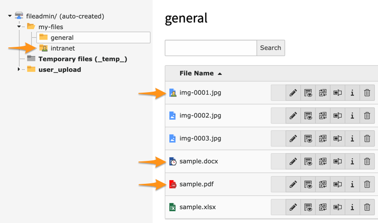

.. ==================================================
.. FOR YOUR INFORMATION
.. --------------------------------------------------
.. -*- coding: utf-8 -*- with BOM.

.. include:: ../Includes.txt

.. _introduction:

Introduction
============

.. _what-it-does:

What does it do?
----------------

This extension protects everything within :file:`/fileadmin/` based on associated folder and file restrictions
(visibility, user groups and dates of publication):

Unlike other similar extensions securing the File Abstraction Layer (FAL) of TYPO3, this extension aims at making it
straightforward to block direct access to your sensitive assets.

No need to configure anything, just install and enable as usual, block direct access at the server level (Apache/Nginx
see below) and... that's it!

Our motto? `KISS <https://en.wikipedia.org/wiki/KISS_principle>`__!

.. _how-does-it-work:

How does it work?
-----------------

The idea is to block direct access at the server level so that your Apache or Nginx web server delegates the handling of
static assets to a small script within this extension which ensures any file and folder restrictions are enforced.

By design, the "_processed_" folder (:file:`/fileadmin/_processed_/`) is not protected and its content (thumbnails or
resized/cropped images) is always freely accessible.
