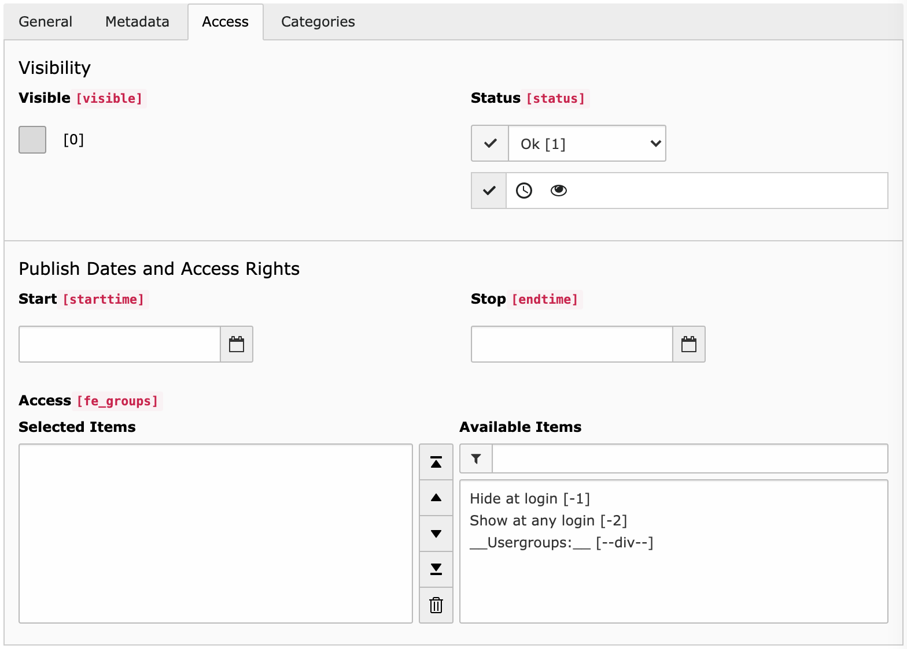
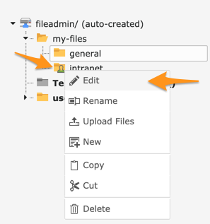
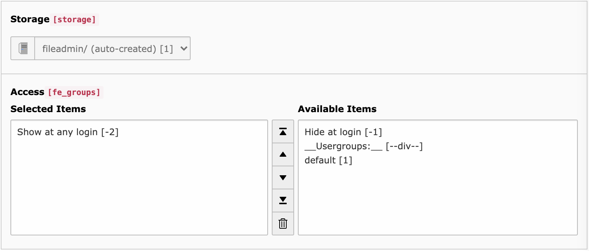

.. include:: ../Includes.rst.txt
.. _users-manual:

Users manual
============

This extension lets you easily protect access to individual files or a whole
folder (and all of its subfolders and files). An overlay is added to both
protected folders and files to make it easier for you to know what you have
secured and what you have not.

To protect a file, edit its metadata and switch to the "Access" tab:

Following options are available:

Visible
  If you turn off the visibility of the file, this has the same effect as
  making other TYPO3 records "hidden". You cannot access it anymore.

Start and Stop Time
  These fields are provided by this extension to let you enforce time-based
  restrictions.

Access
  Similarly to other records, this lets you restrict access to either
  unauthenticated, or authenticated users or any list of Frontend user groups.

To protect a folder, you need to *right click* its icon, either in the tree or
in the list and click the "Folder permissions" menu entry:

You will be presented with an Access form similar to the one for files where
you can choose to restrict access to any user group:

.. hint::

   Effectively, when you protect a folder and/or subfolders and/or individual
   files, whenever a user is trying to access a given file, all parent folders
   are checked to ensure the file is accessible with any possible restriction.
   Finally, restrictions on the file itself are taken into account and if
   access is denied, a 404 HTTP error is returned (or a 403 if configured in
   the extension settings).

.. _why-404-instead-of-403:

Why 404 instead of 403 by default?
----------------------------------

In case you try to access a restricted file and do not have the right to do so,
the logical HTTP status code to use *should be* either a ``403 Forbidden`` (or
possibly a ``401 Unauthorized``) but by doing so, you make it clear for a
malicious user that the resource exists but is not accessible.

We prefer, by default, to issue a ``404 Not Found`` but you can freely choose
to issue a ``403 Forbidden`` in the extension settings. This is particularly
useful if you plan to redirect to a login page when a user tries to access a
restricted resource.
